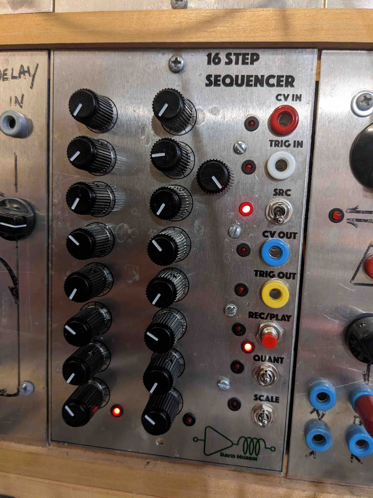

# Pico CV Recorder / 16 Step Sequencer

Using the Raspberry Pi Pico microcontroller to record voltages and replay those voltages for use in a modular synthesizer. The module functions as both a continuous CV recorder and a 16-step analog potentiometer sequencer.

Outputs and inputs are scaled for CV/Gate style modular patching.

Requires installing the [Raspberry Pi Pico C/C++ SDK](https://datasheets.raspberrypi.org/pico/raspberry-pi-pico-c-sdk.pdf).

## Hardware

Todo: add schematics to this repo.

### 16-Step Sequencer Pots

A secondary source for the ADC is a set of analog potentiometers operating between 0 V and 3.3 V. Potentiometer addressing is controlled by CD4051 multiplexer ICs. Each IC addresses 8 pots. By using the inhibit pin as a chip select pin, multiple sets of 8 pots can be addressed. The firmware currently polls 16 pots.

## Panel Connections

### Signal Input/Output

Modular synth systems output bipolar voltages (typically +/-10 V to +/-15 V). The hardware front end shifts the system 0 V to 1.65 V and scales the input to fit the 0 to 3.3 V range of the Pico's ADC. The output stage performs the inverse function, shifting 1.65 V from the DAC back to 0 V and expanding the 0-3.3 V range to the modular system level.

To maintain 1V/Octave accuracy for the external CV input while providing usable sensitivity for the potentiometers, a DPDT switch isolates the input sources. When the potentiometers are selected, the firmware intercepts the ADC reading and applies independent bipolar software scaling. This limits the physical pots to a defined, playable voltage range centered at 0 V without altering the hardware op-amp path.

### Trigger Input/Output

Trigger levels are shifted from the modular system level down to 3.3 V on the way in, and boosted from 3.3 V to the system level on the way out.

## Controls and Interface

- **SRC (DPDT Switch):** Selects the active ADC source (External CV Input vs. Internal Sequencer Pots).
- **QUANT (SP3T Switch):** Sets the output quantization mode.
  - Up: Snap to musical scale
  - Center: Chromatic (semitones)
  - Down: Unquantized (raw CV)
- **SCALE (SP3T Switch):** Sets the mathematical voltage scaling range for the potentiometers.
  - Up: 5 Octaves
  - Center: 2 Octaves
  - Down: 1 Octave
- **REC/PLAY (Push Button):** - Short press: Toggles between recording and playback states.
  - Long press (>1 second): Cycles the active musical scale (Major -> Pentatonic -> Natural Minor).
- **RGB LED Indicator:** Provides visual feedback for the active scale during recording mode.
  - Red: Major
  - Blue: Pentatonic
  - Green: Natural Minor
- **Tempo / Ext Clock (Push-Pull Pot):** The potentiometer controls the internal clock rate. The push-pull switch toggles the external trigger input (`TRIG IN`) to allow external hardware to drive the sequencer clock.
